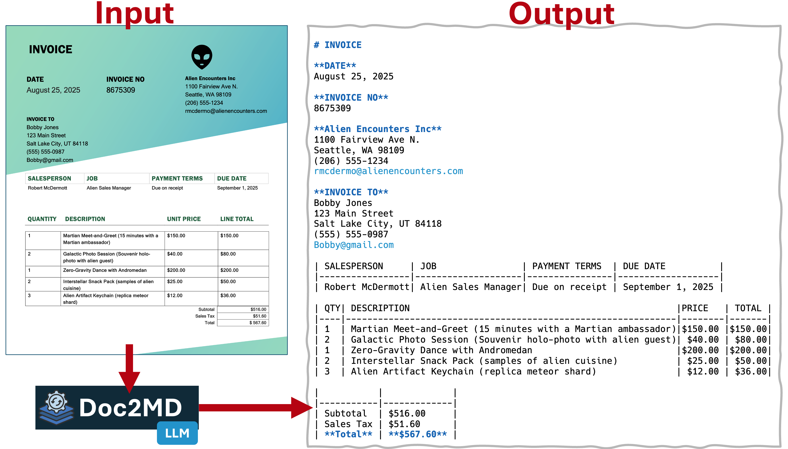

# DOC2MD: Document to Markdown Utility

A utility that extracts text from images or PDFs using a local or remote OpenAI-compatible API endpoint with vision-capable multimodal models. For PDFs, each page is rendered to an image and processed sequentially; outputs are concatenated into a single Markdown document.

## Prerequisites

- A local or remote OpenAI-compatible API server (defaults to `http://localhost:11434/v1/chat/completions`)
- A vision-capable model available on the server (default: `qwen2.5vl`)
- Python 3.12+
- uv package manager

## Installation

Install dependencies:

```bash
uv sync
```

## Usage

### Config file (optional)

You can store defaults in a TOML file. Command-line flags override config values.

Example config file (config.toml):

```toml path=null start=null
[llm]
endpoint = "http://localhost:11434/v1/chat/completions"
model = "qwen2.5vl"
# Optional API key (Bearer token). Do not commit real secrets.
# api_key = "YOUR_API_KEY"
```

Use it with:

```bash
uv run doc2md.py -c config.toml <image_or_pdf_path>
```

Precedence: command-line > config file > environment (for API key) > built-in defaults.

### Basic Usage (Image)

To extract text from an image using the default model:

```bash
uv run doc2md.py <image_path>
```

### Basic Usage (PDF)

To extract text from a multi-page PDF (each page rendered to an image and processed):

```bash
uv run doc2md.py document.pdf
```

### Using a Custom Model and Endpoint

To specify a different vision model and/or endpoint:

```bash
uv run doc2md.py --model <model_name> --endpoint <endpoint_url> <image_or_pdf_path>
# short flags
uv run doc2md.py -m <model_name> -e <endpoint_url> <image_or_pdf_path>
```

### Authentication (optional)

Provide an API key as a Bearer token via either:
- Config file: add `api_key = "YOUR_API_KEY"` under `[llm]` (or top-level)
- Environment variable: set `PDF2MARKDOWN_API_KEY` or `OPENAI_API_KEY`

Example:

```bash
export PDF2MARKDOWN_API_KEY="YOUR_API_KEY"
uv run doc2md.py -c config.toml document.pdf
```

### Saving Output to a File

To save the extracted text to a file instead of printing to stdout:

```bash
uv run doc2md.py --output <output_file> <image_or_pdf_path>
# or using the short flag
uv run doc2md.py -o <output_file> <image_or_pdf_path>
```

### Command Line Options

- `input_path`: Path to the image or PDF file (required)
- `--model`, `-m`: Model name to use for text extraction (default: `qwen2.5vl`)
- `--endpoint`, `-e`: Endpoint URL for the OpenAI-compatible API
- `--config`, `-c`: Path to a TOML config file containing endpoint/model/api_key
- `--output`, `-o`: Output file path to write extracted text (optional, prints to stdout by default)
- `--help`, `-h`: Show help message and exit

### Supported Formats

- JPG/JPEG
- PNG
- GIF
- BMP
- WebP
- PDF

### Examples

```bash
# Extract text from an image using default model
uv run doc2md.py screenshot.png

# Extract text from a PDF and save to a file
uv run doc2md.py -o output.md document.pdf

# Extract text using a specific model
uv run doc2md.py --model qwen2.5vl document.jpg

# Extract text using short model flag
uv run doc2md.py -m qwen2.5vl receipt.png

# Save extracted text to a file
uv run doc2md.py --output extracted_text.md document.png

# Use custom model and save to file
uv run doc2md.py -m qwen2.5vl -o output.md invoice.jpg

# Combine all options
uv run doc2md.py --model qwen2.5vl --output result.md image.png

# Get help and see all options
uv run doc2md.py -h
```

## How It Works

1. Validates the input file exists and has a supported format (image or PDF)
2. For images: encodes the image in base64 format with proper MIME type detection
3. For PDFs: renders each page to a PNG image (at ~144 DPI) and processes pages sequentially
4. Constructs an OpenAI-compatible API request with structured content
5. Sends a POST request to the local API endpoint using the specified model
6. Uses the vision model to analyze the image(s) and extract text in Markdown
7. Concatenates per-page outputs for PDFs and returns a single Markdown document

## Dependencies

- requests>=2.32.4
- pymupdf>=1.24.9 (for PDF rendering)

## Error Handling

The utility handles various error conditions:
- Missing or invalid input files
- Unsupported file formats
- Network connection issues
- API server errors
- Output file write permissions or path issues
